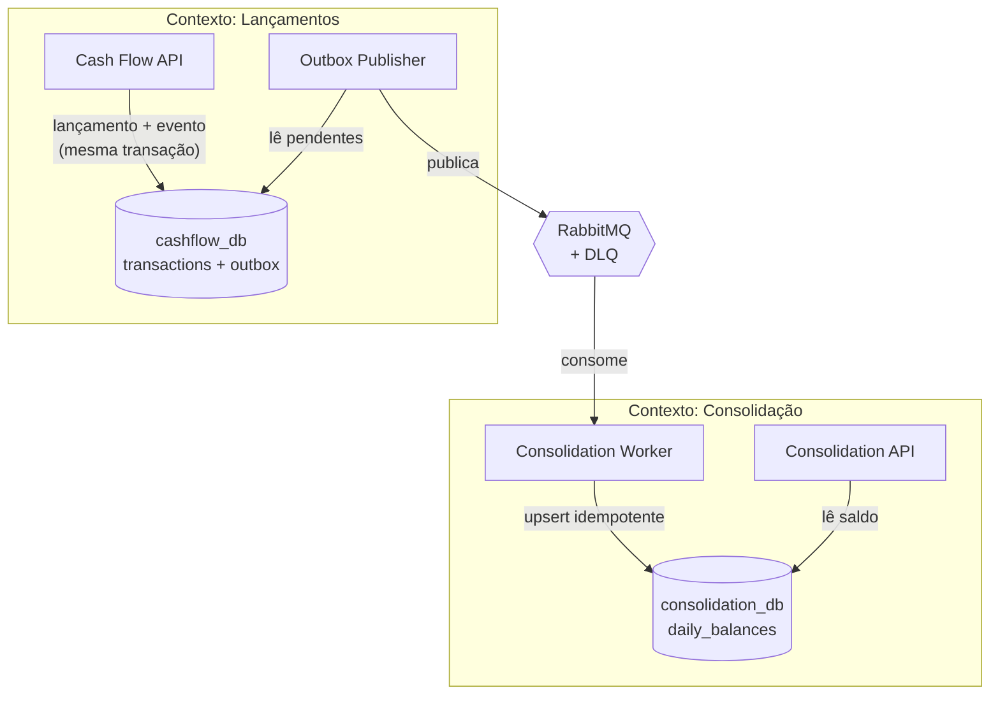

# Cash Flow Challenge

Sistema de gestão de fluxo de caixa: registro de lançamentos de crédito e débito
e relatório de saldo diário consolidado.

---

## Status

**Etapa atual: 8 — Infraestrutura de lançamentos**

```
✅ Requisitos          etapas 1–2
✅ Arquitetura         etapas 3, 5
✅ Contratos           etapa 4
🔨 Implementação       domínio e casos de uso prontos (etapas 6–7);
                       persistência do contexto de lançamentos em andamento
⬜ Endpoints HTTP      etapa 11
⬜ Mensageria          etapas 9–10
```

181 testes automatizados verdes: domínio, casos de uso, fronteiras
arquiteturais e integração com PostgreSQL real. As seções marcadas com ⏳ são
preenchidas conforme as etapas avançam.

| Visão | Documento |
|-------|-----------|
| Estratégica — as 14 etapas e por que nesta ordem | [`docs/roadmap.md`](./docs/roadmap.md) |
| Execução — checklist detalhado e próximo item | [`docs/progress.md`](./docs/progress.md) |

---

## Sobre o projeto

Um lojista precisa gerenciar o fluxo de caixa do dia a dia, registrando créditos e
débitos, e demanda um relatório com o saldo consolidado diariamente.

O desafio impõe um requisito não funcional que define toda a arquitetura:

> A aplicação de gestão de lançamentos precisa continuar operante **mesmo em caso
> de falha no sistema de consolidação diária**.

Enunciado completo: [`docs/challenge/`](./docs/challenge/desafio-desenvolvedor-software.pdf)

## Requisitos

| Categoria | Documento |
|-----------|-----------|
| Funcionais, não funcionais, restrições, premissas | [`docs/requirements.md`](./docs/requirements.md) |
| Escopo do MVP e o que ficou de fora | [`docs/scope.md`](./docs/scope.md) |

Resumo dos requisitos funcionais:

| ID | Requisito |
|----|-----------|
| RF-001 | Registrar um lançamento financeiro |
| RF-002 | Classificar o lançamento como crédito ou débito |
| RF-003 | Consultar os lançamentos registrados |
| RF-004 | Calcular o saldo consolidado diário |
| RF-005 | Consultar o saldo consolidado de um determinado dia |
| RF-006 | Consultar a consolidação sem depender do serviço de lançamentos |

## Arquitetura

Dois contextos independentes, comunicando-se **apenas** por eventos assíncronos.
Nenhuma chamada HTTP síncrona entre eles, nenhum banco compartilhado.

Detalhamento completo: [`docs/architecture.md`](./docs/architecture.md)

## Diagrama



## Tecnologias

| Camada | Tecnologia | Decisão |
|--------|-----------|---------|
| Linguagem / runtime | C# / .NET 10 (LTS) | [ADR-012](./docs/decisions/ADR-012-tech-stack.md) |
| API | ASP.NET Core (controllers) | [ADR-012](./docs/decisions/ADR-012-tech-stack.md) |
| Persistência | PostgreSQL + EF Core | [ADR-005](./docs/decisions/ADR-005-database.md) |
| Mensageria | RabbitMQ | [ADR-003](./docs/decisions/ADR-003-messaging.md) |
| Testes | xUnit, FluentAssertions, NSubstitute, Testcontainers | [ADR-008](./docs/decisions/ADR-008-tdd.md) |
| Carga | k6 | [ADR-010](./docs/decisions/ADR-010-performance-validation.md) |
| Logs | `ILogger` + JSON console | [ADR-011](./docs/decisions/ADR-011-observability.md) |
| Ambiente | Docker + Docker Compose | [ADR-009](./docs/decisions/ADR-009-containers.md) |
| CI | GitHub Actions | [`testing-strategy.md`](./docs/testing-strategy.md#integração-contínua) |

## Estrutura do projeto

```
docs/                  documentação, ADRs e enunciado
.github/workflows/     pipeline de CI
src/                   código-fonte
tests/                 testes automatizados
k6/                    testes de carga (⏳ etapa 13)
docker-compose.yml     ambiente local
```

Estrutura de projetos: [`docs/architecture.md`](./docs/architecture.md) §8.

## Como executar

**Pré-requisitos:** Docker e Docker Compose. O SDK do .NET 10 é necessário apenas
para rodar os testes fora do container.

```bash
cp .env.example .env
docker compose up -d
```

| Serviço | Endereço |
|---------|----------|
| Cash Flow API | http://localhost:5001 |
| Consolidation API | http://localhost:5002 |
| RabbitMQ (management) | http://localhost:15672 |
| `cashflow_db` | `localhost:5432` |
| `consolidation_db` | `localhost:5433` |

Para reiniciar do zero: `docker compose down -v && docker compose up -d`.

O ambiente completo ocioso consome cerca de 240 MiB somando os seis containers.

⏳ *Os endpoints entram na etapa 11 do [roadmap](./docs/roadmap.md); hoje os
serviços sobem e expõem apenas a especificação OpenAPI.*

### Testes

```bash
dotnet test                                   # suíte completa
dotnet test --filter Category=Unit            # unitários, sem Docker
dotnet test --filter Category=Architecture    # fronteiras de camada
dotnet test --filter Category=Integration     # exige Docker
```

## API

Contrato completo — DTOs, validações, códigos de erro e schema do evento:
[`docs/api-contracts.md`](./docs/api-contracts.md).

| Método | Rota | Serviço | O que faz |
|--------|------|---------|-----------|
| `POST` | `/transactions` | Cash Flow | Registra um lançamento — `201` mesmo com o RabbitMQ fora do ar |
| `GET` | `/transactions` | Cash Flow | Lista com paginação por cursor e filtro por período |
| `GET` | `/transactions/{id}` | Cash Flow | Consulta um lançamento |
| `GET` | `/daily-balances/{date}` | Consolidation | Saldo consolidado do dia |

A URL base de cada serviço vem da tabela de portas acima.

```bash
curl -X POST "$CASHFLOW_API/transactions" \
  -H 'Content-Type: application/json' \
  -d '{"type":"CREDIT","amount":1500.00,"occurredAt":"2026-08-08T14:30:00Z"}'
```

```json
{
  "date": "2026-08-08",
  "totalCredits": 1500.00,
  "totalDebits": 700.00,
  "balance": 800.00,
  "updatedAt": "2026-08-08T14:32:15Z"
}
```

Erros seguem [Problem Details (RFC 7807)](https://www.rfc-editor.org/rfc/rfc7807),
sempre com o `correlationId` que permite rastrear a requisição pelos quatro
processos do fluxo.

⏳ *Especificação OpenAPI gerada do código a partir da etapa 11.*

## Decisões arquiteturais

14 ADRs documentam contexto, alternativas avaliadas, consequências e trade-offs de
cada escolha: [`docs/decisions/`](./docs/decisions/README.md).

As principais:

- [ADR-001](./docs/decisions/ADR-001-architecture.md) — Clean Architecture com SOLID
- [ADR-002](./docs/decisions/ADR-002-service-decomposition.md) — Dois serviços independentes
- [ADR-004](./docs/decisions/ADR-004-transactional-outbox.md) — Transactional Outbox
- [ADR-007](./docs/decisions/ADR-007-idempotency.md) — Idempotência no consumidor

## Consistência dos dados

O sistema opera com **consistência eventual** entre lançamentos e saldo: um
lançamento recém-registrado leva alguns segundos para refletir no saldo consolidado.
Isso é consequência direta da independência exigida pelo enunciado, e não um
defeito. Detalhes e garantias: [ADR-006](./docs/decisions/ADR-006-consistency.md).

## Resiliência

| Componente fora do ar | `POST /transactions` | `GET /daily-balances` |
|-----------------------|----------------------|------------------------|
| Consolidation API | ✅ funciona | ❌ indisponível |
| Consolidation Worker | ✅ funciona | ⚠️ dados defasados |
| `consolidation_db` | ✅ funciona | ❌ indisponível |
| RabbitMQ | ✅ funciona | ⚠️ dados defasados |

Nenhuma falha do lado da consolidação impede o registro de lançamentos, e nenhum
evento é perdido — apenas atrasado.

## Testes

TDD como fluxo de desenvolvimento, não como etapa posterior:
[`docs/testing-strategy.md`](./docs/testing-strategy.md) e
[ADR-008](./docs/decisions/ADR-008-tdd.md).

O pipeline de CI roda `restore → build → unitários → arquitetura → integração` em
todo Pull Request, e `master` só aceita merge com o pipeline verde. A garantia de
qualidade é uma propriedade do repositório, não uma promessa desta seção.

Estado atual da suíte:

| Categoria | Testes | O que cobre |
|-----------|--------|-------------|
| Unitários | 141 | Domínio (RN-001 a RN-004) e casos de uso com dublês |
| Arquitetura | 20 | Fronteiras entre camadas e entre os dois contextos |
| Integração | 20 | Persistência contra PostgreSQL real, via Testcontainers |

## Performance

Requisito: 50 chamadas/s com perda máxima de 5%.
Meta interna: erro HTTP < 1%.

"Chamadas" é ambíguo no enunciado — pode ser leitura do saldo ou ingestão de
eventos. A interpretação principal adotada é a **leitura da consolidação sob
carga**, medida com k6. A convergência ponta a ponta (lançamento → RabbitMQ →
worker → saldo) é provada por teste funcional, que não precisa de carga para ser
convincente. Carga de escrita e de ingestão são extras, executados se sobrar
tempo.

Critérios: [ADR-010](./docs/decisions/ADR-010-performance-validation.md).

⏳ *Resultados medidos serão publicados aqui na etapa 13.*

## Observabilidade

Logs estruturados em JSON, correlation id propagado entre os quatro processos do
fluxo e health checks `live`/`ready`:
[ADR-011](./docs/decisions/ADR-011-observability.md).

## Trade-offs

| Escolha | Ganho | Custo aceito |
|---------|-------|--------------|
| Dois serviços em vez de um | Independência de falha | Mais infraestrutura e complexidade operacional |
| Mensageria assíncrona | Absorve pico, desacopla | Consistência eventual, debugging distribuído |
| Outbox | Zero perda de evento | Latência extra, tabela e worker adicionais |
| Bases separadas | Isolamento real de falha | Dado duplicado, sem JOIN entre contextos |
| Saldo pré-calculado | Leitura O(1) | Escrita mais cara, risco de divergência |
| TDD | Design testável, regressão barata | Ritmo inicial mais lento |
| Outbox e retry implementados à mão | Mecanismos visíveis e auditáveis | Mais código que usar MassTransit |

Cada custo está detalhado na ADR correspondente. Nenhuma peça da arquitetura existe
sem um requisito que a justifique — a
[matriz de rastreabilidade](./docs/requirements.md#5-matriz-de-rastreabilidade--requisito--decisão)
liga cada decisão ao requisito que a originou.

## Melhorias futuras

Itens conscientemente fora do MVP ([`docs/scope.md`](./docs/scope.md)):

- **Idempotency-Key** em `POST /transactions`, protegendo contra reenvio do cliente
- **Fuso horário do lojista** na definição do dia da consolidação (hoje: UTC)
- **Reconciliação periódica** entre lançamentos e saldo, detectando divergência
- **Expurgo** de `outbox_messages` e `processed_events` por política de retenção
- **OpenTelemetry + Jaeger + Prometheus** para tracing e métricas
- **Rotina de reprocessamento da DLQ** sem intervenção manual
- **Saldo acumulado** e consulta por período
- **Multi-tenant**, para atender múltiplos lojistas
- **`SELECT ... FOR UPDATE SKIP LOCKED`** no outbox, para múltiplas instâncias do
  publisher — otimização de vazão, não condição de correção ([ADR-004](./docs/decisions/ADR-004-transactional-outbox.md))
- **Migrations como passo de deploy**, em vez de no startup da aplicação
- **CD e análise estática** no pipeline — a CI de build e testes entra já na
  etapa 5
