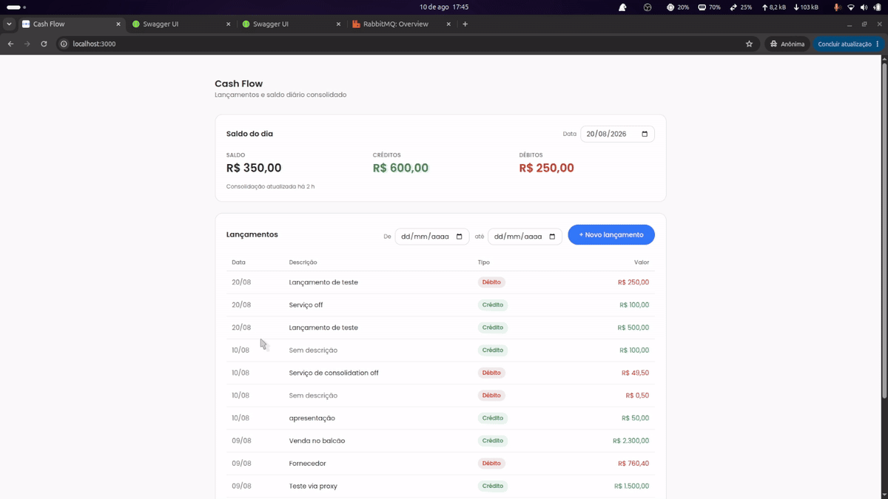
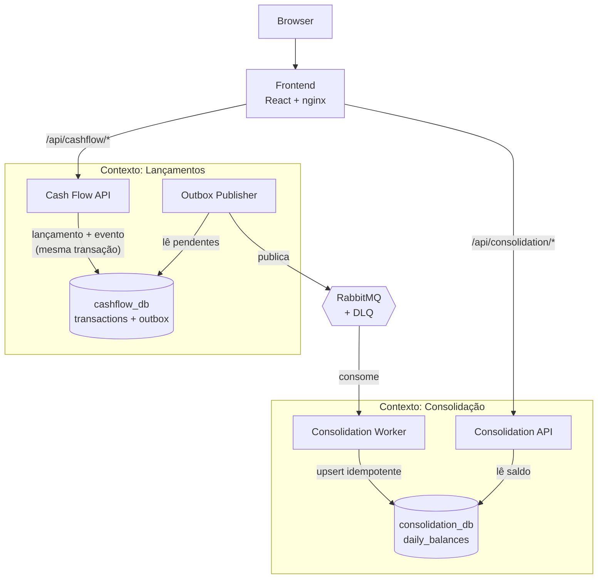

# Cash Flow Challenge

Sistema de gestão de fluxo de caixa: registro de lançamentos de crédito e débito
e relatório de saldo diário consolidado.



**Apresentação em vídeo (23 min):**
[`docs/assets/apresentacao.mp4`](./docs/assets/apresentacao.mp4) — o problema, a
arquitetura, a demonstração dos cenários de falha e as decisões que sustentam o
requisito de independência entre os dois contextos.

## O problema

Um lojista precisa registrar créditos e débitos e consultar o saldo consolidado
do dia. O desafio impõe um requisito não funcional que define toda a arquitetura:

> A aplicação de gestão de lançamentos precisa continuar operante **mesmo em caso
> de falha no sistema de consolidação diária**.

Enunciado completo: [`docs/challenge/`](./docs/challenge/desafio-desenvolvedor-software.pdf).
Requisitos mapeados: [`docs/requirements.md`](./docs/requirements.md).

## A solução

Dois contextos independentes que **não se comunicam por HTTP** e não compartilham
banco. O serviço de lançamentos grava o evento em uma tabela de **outbox na mesma
transação** do lançamento; um publisher assíncrono o envia ao RabbitMQ; um worker
o aplica de forma **idempotente** ao saldo do dia. A consolidação inteira pode
estar fora do ar sem impedir um único lançamento — e nenhum evento é perdido,
apenas atrasado.



Stack: **.NET 10 / ASP.NET Core**, **PostgreSQL + EF Core**, **RabbitMQ**,
**React 19 + TypeScript** servido por nginx, tudo em **Docker Compose**.
Diagramas C4, fluxos e comportamento sob falha:
[`docs/architecture.md`](./docs/architecture.md).

## Como executar

**Pré-requisito:** Docker e Docker Compose. As migrations são aplicadas na
inicialização — um clone limpo sobe funcional com:

```bash
cp .env.example .env
docker compose up -d
```

| Serviço | Endereço |
|---------|----------|
| **Interface** | **http://localhost:3000** |
| Cash Flow API (Swagger em `/swagger`) | http://localhost:5001 |
| Consolidation API (Swagger em `/swagger`) | http://localhost:5002 |
| RabbitMQ (management) | http://localhost:15672 |

Contrato completo das APIs — DTOs, validações, erros (RFC 7807) e o schema do
evento: [`docs/api-contracts.md`](./docs/api-contracts.md).

| Método | Rota | Serviço |
|--------|------|---------|
| `POST` | `/transactions` | Cash Flow — `201` mesmo com o RabbitMQ fora do ar |
| `GET` | `/transactions` | Cash Flow — paginação por cursor e filtro por período |
| `GET` | `/transactions/{id}` | Cash Flow |
| `GET` | `/daily-balances/{date}` | Consolidation — saldo consolidado do dia |

## Como provar

**Testes — 257 automatizados, CI verde obrigatória para merge:**

```bash
dotnet test                        # unitários + arquitetura + integração (Docker)
cd src/Frontend && npm ci && npm run test
```

| Categoria | Testes | O que cobre |
|-----------|--------|-------------|
| Unitários | 143 | Domínio (RN-001 a RN-004) e casos de uso com dublês |
| Arquitetura | 20 | Fronteiras entre camadas e entre os dois contextos |
| Integração | 92 | Banco, broker e endpoints reais, via Testcontainers |
| Ponta a ponta | 2 | `POST /transactions` → RabbitMQ → worker → saldo |

**Resiliência — os quatro cenários foram executados, não apenas descritos:**

| Componente derrubado | `POST /transactions` | Recuperação ao voltar |
|----------------------|----------------------|------------------------|
| Consolidation API | `201` | automática |
| Consolidation Worker | `201` | consome o backlog da fila |
| `consolidation_db` | `201` | mensagem volta à fila e reprocessa |
| RabbitMQ | `201` | outbox retém e republica |

Em todos, o saldo final igualou a soma do que foi registrado. Resultados
detalhados: [`docs/architecture.md`](./docs/architecture.md) §6. A própria tela
demonstra os dois comportamentos centrais: o saldo converge sozinho com
"atualizado há N s" ao lado (consistência eventual), e com a consolidação parada
o card exibe erro enquanto o formulário continua registrando (degradação
parcial).

**Carga — requisito de 50 chamadas/s com perda máxima de 5%:**

| Cenário (k6) | Carga | Erro | p95 |
|--------------|-------|------|-----|
| Leitura do saldo (obrigatório) | 50,0 req/s por 30 s | 0,00% | 2,27 ms |
| Escrita de lançamentos (extra) | 50,0 req/s por 30 s | 0,00% | 4,42 ms |

**Perda de eventos: zero** — os 1 501 lançamentos registrados sob carga
apareceram inteiros no saldo, com outbox e DLQ vazios. Medição local (i7-7700HQ,
tudo na mesma máquina); condições, thresholds e interpretação da ambiguidade do
enunciado: [`k6/README.md`](./k6/README.md) e
[ADR-010](./docs/decisions/ADR-010-performance-validation.md).

## Decisões que importam

15 ADRs registram contexto, alternativas e trade-offs:
[`docs/decisions/`](./docs/decisions/README.md). As cinco que definem o sistema:

| Decisão | Por quê | Custo aceito |
|---------|---------|--------------|
| [Dois serviços independentes](./docs/decisions/ADR-002-service-decomposition.md) | Falha na consolidação não pode parar lançamentos | Mais infraestrutura |
| [Transactional Outbox](./docs/decisions/ADR-004-transactional-outbox.md) | Lançamento e evento na mesma transação — zero perda | Latência extra, publisher próprio |
| [Idempotência no consumidor](./docs/decisions/ADR-007-idempotency.md) | Entrega *at-least-once* não pode duplicar saldo | Tabela `processed_events` |
| [Consistência eventual](./docs/decisions/ADR-006-consistency.md) | Consequência direta da independência exigida | Saldo defasado por segundos, exposto via `updatedAt` |
| [Frontend de demonstração](./docs/decisions/ADR-015-frontend.md) | Tornar visível o que em JSON parece defeito | Uma tela, sem regra de negócio nem soma no cliente |

TDD como fluxo ([ADR-008](./docs/decisions/ADR-008-tdd.md)), logs estruturados
com `correlationId` ponta a ponta ([ADR-011](./docs/decisions/ADR-011-observability.md))
e health checks `live`/`ready` — o `ready` da Cash Flow API ignora o RabbitMQ de
propósito: marcá-la não-pronta com o broker fora produziria justamente a
indisponibilidade que o requisito proíbe.

## Melhorias futuras

Conscientemente fora do escopo ([`docs/scope.md`](./docs/scope.md)):

- **Idempotency-Key** em `POST /transactions`, contra reenvio do cliente
- **Fuso horário do lojista** na definição do dia da consolidação (hoje: UTC)
- **Reconciliação periódica** entre lançamentos e saldo
- **Expurgo** de `outbox_messages` e `processed_events` por retenção
- **OpenTelemetry** para tracing e métricas
- **Reprocessamento automático da DLQ**
- **`SELECT ... FOR UPDATE SKIP LOCKED`** no outbox, para múltiplos publishers
- **Migrations como passo de deploy**, em vez de no startup

## Documentação

O detalhamento — requisitos, escopo, arquitetura, contratos, estratégia de testes
e a ordem de construção — está em [`docs/`](./docs/README.md).
