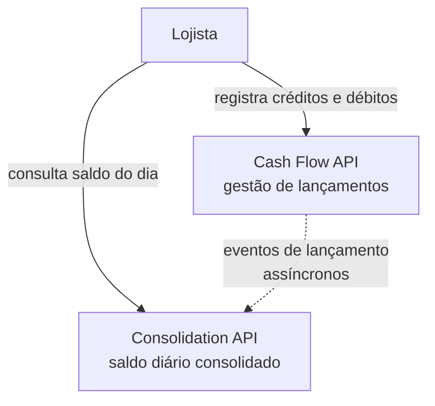
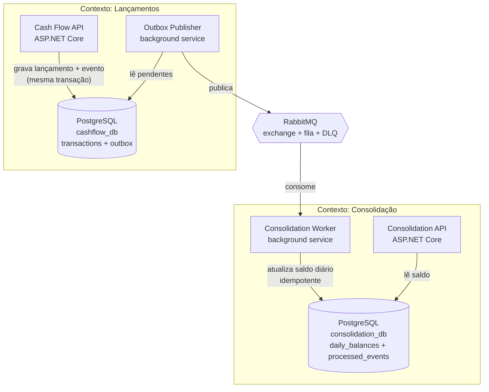
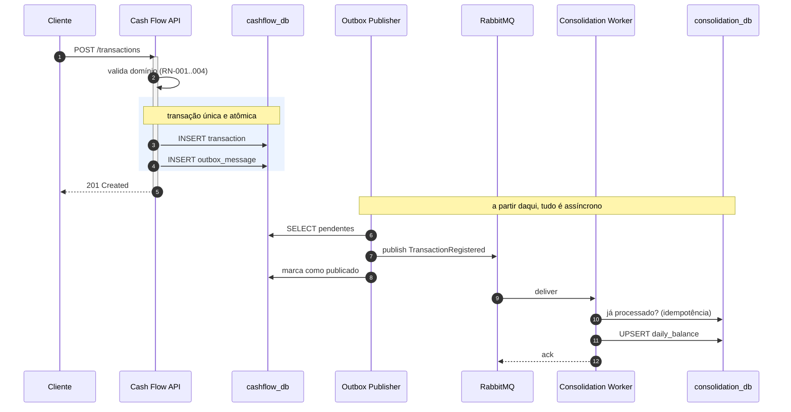
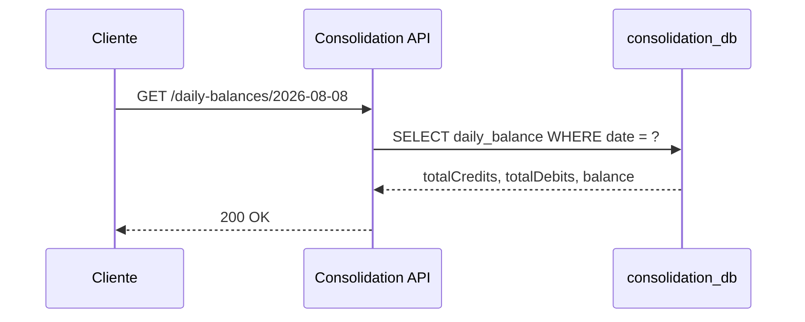
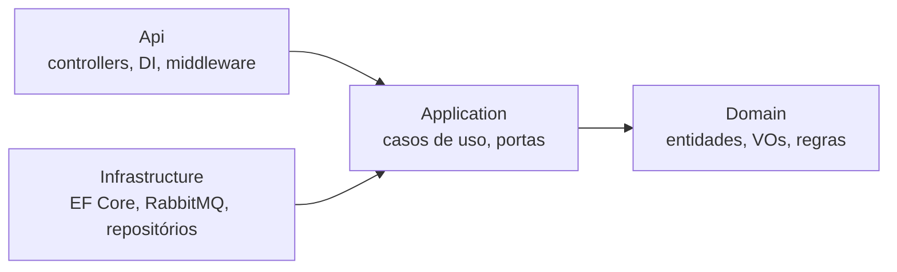

# Arquitetura

> Visão arquitetural do CashFlow. As justificativas individuais de cada escolha
> estão nas [ADRs](./decisions/README.md); aqui está o quadro completo.

## 1. Princípio orientador

O enunciado **não exige** uma arquitetura específica. Ele exige um
**comportamento**:

> "A aplicação de gestão de lançamentos precisa continuar operante mesmo em caso
> de falha no sistema de consolidação diária."

Toda a arquitetura abaixo é consequência desse comportamento. Se esse requisito
não existisse, um único serviço monolítico com uma tabela de saldo atualizada em
transação seria a resposta correta e mais simples.

## 2. Visão de contexto (C4 — Nível 1)



A linha tracejada é intencional: é a única ligação entre os dois contextos, e ela
é **assíncrona**. Não existe chamada HTTP síncrona de um serviço para o outro.

## 3. Visão de containers (C4 — Nível 2)



### Componentes

| Componente | Responsabilidade | Falha isolada? |
|------------|------------------|----------------|
| Cash Flow API | Receber e persistir lançamentos | Não — é o caminho crítico |
| `cashflow_db` | Lançamentos + tabela de outbox | Não — é o caminho crítico |
| Outbox Publisher | Ler eventos pendentes e publicar na fila | Sim — atrasa, não bloqueia |
| RabbitMQ | Transporte e buffer de eventos | Sim — eventos ficam retidos no outbox |
| Consolidation Worker | Consumir eventos e atualizar saldos | Sim — eventos ficam na fila |
| `consolidation_db` | Saldos diários + controle de idempotência | Sim |
| Consolidation API | Expor o saldo consolidado | Sim |

**Somente os dois primeiros são caminho crítico.** Essa coluna é a materialização
de RNF-001.

## 4. Fluxo principal — registro de lançamento



O ponto arquitetural crítico está no retângulo destacado: o lançamento e o evento
são gravados na **mesma transação de banco**. Isso elimina a janela em que o
lançamento existe mas o evento se perdeu (ou vice-versa) — o problema clássico do
*dual write*. Ver [ADR-004](./decisions/ADR-004-transactional-outbox.md).

## 5. Fluxo de consulta — saldo consolidado



A consulta é uma leitura de valor **pré-calculado**, não uma agregação sobre a
tabela de lançamentos. É isso que permite sustentar o pico de leitura de 50 req/s
sem que o custo cresça com o volume histórico de lançamentos.

## 6. Comportamento sob falha

Cenários que demonstram RNF-001, RNF-005 e RNF-007:

| Componente fora do ar | `POST /transactions` | `GET /daily-balances` | Recuperação |
|-----------------------|----------------------|------------------------|-------------|
| Consolidation API | ✅ funciona | ❌ indisponível | Automática ao subir |
| Consolidation Worker | ✅ funciona | ⚠️ dados defasados | Consome o backlog da fila |
| `consolidation_db` | ✅ funciona | ❌ indisponível | Mensagem volta para a fila e é reprocessada quando o banco retorna |
| RabbitMQ | ✅ funciona | ⚠️ dados defasados | Outbox retém e republica ao voltar |
| Outbox Publisher | ✅ funciona | ⚠️ dados defasados | Publica o acumulado ao voltar |
| Cash Flow API | ❌ indisponível | ✅ funciona | — |
| `cashflow_db` | ❌ indisponível | ✅ funciona | — |

Nenhuma falha do lado da consolidação produz erro no registro de lançamentos.
Em todos esses casos o sistema converge sozinho quando o componente retorna:
nenhum evento é perdido, apenas atrasado.

Isso precisa valer também na configuração do ambiente, e não só no código: nenhum
serviço declara o RabbitMQ como dependência de startup, e a prontidão da Cash Flow
API não considera o broker. Ver [ADR-009](./decisions/ADR-009-containers.md) e
[ADR-011](./decisions/ADR-011-observability.md).

### Resultados medidos (etapa 12)

Executados com `docker compose`, derrubando um componente por vez e registrando a
resposta observada:

| Cenário | `POST /transactions` | `GET /daily-balances` | Convergência após retorno |
|---------|----------------------|------------------------|---------------------------|
| Consolidation API parada | `201` | conexão recusada | automática |
| Consolidation Worker parado | `201` | `200`, saldo defasado, 1 mensagem enfileirada | consome o backlog |
| `consolidation_db` parado | `201` | `500` | automática |
| RabbitMQ parado | `201` | `200`, saldo defasado, 1 evento retido no outbox | outbox republica |

Em todos os quatro, `/health/ready` da Cash Flow API permaneceu `200`, e o saldo
final igualou a soma de tudo o que foi registrado: nenhum evento perdido, apenas
atrasado.

**Um defeito encontrado ao executar os cenários.** A primeira execução com o
`consolidation_db` fora do ar por 40 segundos mandou o evento para a DLQ e o saldo
não convergiu — a janela de retry do consumidor era menor que a queda. A DLQ é
para mensagem problemática, não para infraestrutura indisponível: um evento válido
não pode virar trabalho manual porque o banco piscou. O consumidor passou a
distinguir os dois casos por `DbException.IsTransient` e devolve a mensagem à fila
quando a falha é de conectividade. Reexecutado, o saldo converge e a DLQ fica
vazia.

## 7. Clean Architecture — camadas



Regra de dependência: **as setas apontam sempre para dentro**.

| Camada | Contém | Pode referenciar | Proibido |
|--------|--------|------------------|----------|
| `Domain` | Entidades, Value Objects, eventos de domínio, exceções de negócio | Nada | EF Core, RabbitMQ, ASP.NET, qualquer I/O |
| `Application` | Casos de uso, interfaces de porta (`ITransactionRepository`, `IEventPublisher`), DTOs | `Domain` | Implementações concretas de infraestrutura |
| `Infrastructure` | EF Core, migrations, cliente RabbitMQ, implementações das portas | `Domain`, `Application` | Conhecer a camada de API |
| `Api` | Endpoints HTTP, validação de entrada, DI, middleware de erro | `Application`, `Infrastructure` (só no *composition root*) | Conter regra de negócio |

A regra é verificável por teste automatizado de arquitetura, não apenas por
convenção. Ver [ADR-001](./decisions/ADR-001-architecture.md).

## 8. Estrutura de solução pretendida

```
src/
├── CashFlow.Domain/                  entidades, VOs, regras
├── CashFlow.Application/             casos de uso, portas
├── CashFlow.Infrastructure/          EF Core, outbox, RabbitMQ
├── CashFlow.Api/                     API de lançamentos
├── Consolidation.Domain/
├── Consolidation.Application/
├── Consolidation.Infrastructure/
├── Consolidation.Api/                API de saldo consolidado
├── Consolidation.Worker/             consumidor de eventos
└── Shared.Contracts/                 contratos dos eventos de integração
tests/
├── *.UnitTests/                      domínio e aplicação
├── *.IntegrationTests/               banco, fila, endpoints
├── EndToEndTests/                    o sistema inteiro, os dois contextos juntos
└── ArchitectureTests/                fronteiras de camada
k6/                                   testes de carga
docs/                                 esta documentação
.github/workflows/                    pipeline de CI
```

`Shared.Contracts` contém **apenas** os contratos dos eventos de integração e os
nomes da topologia que os transporta — nada de regra de negócio. É o único
acoplamento aceito entre os dois contextos, e é um acoplamento de esquema, não de
código executável.

`EndToEndTests` é o único projeto que referencia os dois contextos. Ele existe
para verificar a integração entre eles, que por definição não cabe em nenhum dos
dois lados — e é por isso que os projetos de produção continuam sem se
referenciar, o que os testes de arquitetura garantem.

## 9. Modelo de dados

### `cashflow_db`

```
transactions
├── id                 uuid PK
├── type               varchar  CREDIT | DEBIT
├── amount             numeric(18,2)
├── occurred_at        timestamptz
├── description        varchar null
└── created_at         timestamptz

outbox_messages
├── id                 uuid PK
├── type               varchar
├── payload            jsonb
├── occurred_at        timestamptz
├── processed_at       timestamptz null
├── attempts           int
└── error              text null
```

### `consolidation_db`

```
daily_balances
├── date               date PK
├── total_credits      numeric(18,2)
├── total_debits       numeric(18,2)
└── updated_at         timestamptz

processed_events
├── event_id           uuid PK
└── processed_at       timestamptz
```

Não há coluna `balance`: o saldo é a diferença entre os dois totais, calculada na
leitura. Uma terceira coluna seria uma terceira coisa para divergir das duas que a
originaram.

`processed_events` é o mecanismo de idempotência: a chave primária transforma o
reprocessamento em uma violação de unicidade detectável, em vez de uma soma
duplicada. Ver [ADR-007](./decisions/ADR-007-idempotency.md).

### Aplicação das migrations

Cada serviço aplica as migrations do **seu** banco na inicialização
(`Database.Migrate()`), de modo que `docker compose up -d` em um clone limpo
produza um sistema funcional sem passo manual — o critério de aceite da etapa 14.
A Cash Flow API cuida do `cashflow_db`; a Consolidation API, do
`consolidation_db`. O worker não aplica nada: dois processos migrando o mesmo
banco ao subir juntos é corrida sem ganho.

Migrar no startup é adequado a um ambiente de avaliação e inadequado a produção,
onde o passo pertence ao deploy — registrado como melhoria futura no README. A
composição que executa isso entra na etapa 11, junto do resto do *composition
root*.

## 10. Contrato do evento de integração

```json
{
  "eventId": "0d9f1f4c-2f4e-4c1a-9a4e-6b1c0c2f0f11",
  "eventType": "TransactionRegistered",
  "eventVersion": 1,
  "occurredAt": "2026-08-08T14:32:11Z",
  "correlationId": "b1f2c3d4-5e6f-4a7b-8c9d-0e1f2a3b4c5d",
  "data": {
    "transactionId": "6c6a2f4e-1b2c-4d3e-8f90-1a2b3c4d5e6f",
    "type": "CREDIT",
    "amount": 1500.00,
    "occurredAt": "2026-08-08T14:30:00Z"
  }
}
```

`eventId` é o que garante a idempotência no consumidor. `data.occurredAt` é o que
determina o dia da consolidação — deliberadamente distinto de `occurredAt` do
envelope, que é o instante da emissão. `correlationId` liga o evento à requisição
HTTP que o originou ([ADR-011](./decisions/ADR-011-observability.md)), e
`eventVersion` existe para que uma mudança incompatível de schema seja uma decisão
explícita, e não uma quebra silenciosa.

Campo a campo, propriedades AMQP e política de evolução do schema:
[`api-contracts.md`](./api-contracts.md) §5.

## 11. Trade-offs assumidos

| Escolha | Ganho | Custo aceito |
|---------|-------|--------------|
| Dois serviços em vez de um | Independência de falha (RNF-001) | Mais infraestrutura, mais complexidade operacional |
| Mensageria assíncrona | Absorve pico, desacopla (RNF-003) | Consistência eventual, debugging distribuído |
| Outbox | Zero perda de evento (RNF-007) | Latência extra, tabela e worker adicionais |
| Bases separadas | Isolamento real de falha (RNF-002) | Dado duplicado, sem JOIN entre contextos |
| Saldo pré-calculado | Leitura O(1) | Escrita mais cara, risco de divergência |
| TDD | Design testável e regressão barata | Ritmo inicial mais lento |
| Docker Compose | Reprodutibilidade (RNF-012) | Não representa um ambiente produtivo real |

Nenhuma dessas escolhas é gratuita, e o custo de cada uma está registrado na ADR
correspondente.

## 12. O que esta arquitetura deliberadamente **não** faz

- Não usa CQRS com event sourcing — o overhead não se paga neste escopo.
- Não usa Saga/orquestração — não há transação distribuída com compensação.
- Não usa API Gateway — dois serviços não justificam a camada extra.
- Não usa cache distribuído — a leitura já é O(1) sobre um índice de chave primária.
- Não usa Kubernetes — Docker Compose atende ao requisito de execução local.

Cada um desses itens seria defensável em um sistema maior. Aqui seriam
complexidade sem requisito que a justifique.
