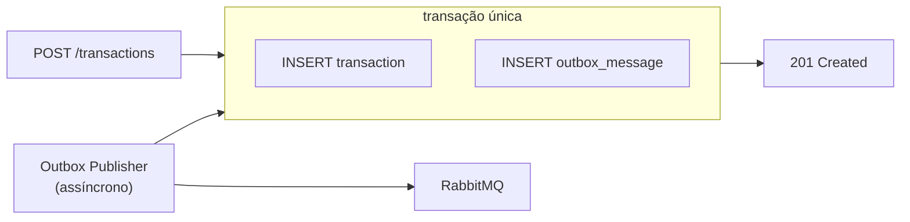

# ADR-004 — Transactional Outbox para publicação confiável de eventos

- **Status:** Aceito
- **Data:** 2026-08-08
- **Decisores:** rafaelomodei

## Contexto

Ao registrar um lançamento, precisamos de duas coisas: **persistir no banco** e
**publicar um evento**. Fazer as duas diretamente é o problema clássico do
*dual write* — duas escritas em sistemas diferentes sem transação comum:

```
INSERT transaction   ✅
publish evento       ❌ broker caiu
→ lançamento existe, saldo nunca consolida (perda silenciosa)
```

```
publish evento       ✅
INSERT transaction   ❌ banco falhou
→ saldo consolidado de um lançamento que não existe
```

Nenhum dos dois é aceitável frente a RNF-004 (perda ≤ 5%, meta 0%) e RNF-007
(eventos não processados devem poder ser processados depois).

## Decisão

Adotamos o padrão **Transactional Outbox**:

1. O lançamento e o registro do evento são gravados na **mesma transação de banco**.
   Ou os dois existem, ou nenhum existe.
2. Um `BackgroundService` (**Outbox Publisher**) lê periodicamente as mensagens
   pendentes e as publica no RabbitMQ.
3. A mensagem só é marcada como publicada **após o publisher confirm** do broker.
4. Falha na publicação incrementa `attempts` e a mensagem é retentada no ciclo
   seguinte, com backoff.



O ponto essencial: a resposta HTTP `201` **não depende** do broker. Se o RabbitMQ
estiver inteiramente fora do ar, o lançamento é registrado normalmente e o evento
fica retido no outbox até o broker voltar. É assim que RNF-001 se sustenta na
prática.

### Esquema

```
outbox_messages
├── id            uuid PK
├── type          varchar     ex.: TransactionRegistered
├── payload       jsonb       envelope serializado
├── occurred_at   timestamptz
├── processed_at  timestamptz null   null = pendente
├── attempts      int
└── error         text null
índice parcial: (occurred_at) WHERE processed_at IS NULL
```

O índice parcial mantém a varredura de pendentes barata mesmo com a tabela
crescendo, já que a esmagadora maioria das linhas estará processada.

### Escopo do publisher no MVP

O MVP roda **uma única instância do publisher**. Isso é deliberado: o que o
desafio pede para demonstrar é a cadeia

```
commit do lançamento ✅  +  RabbitMQ fora do ar ❌
        ↓
evento permanece pendente no outbox
        ↓
API continua respondendo 201
        ↓
broker volta
        ↓
evento é publicado e o saldo converge
```

Nada disso depende de concorrência entre publishers.

Para **múltiplas instâncias**, o mecanismo previsto é
`SELECT ... FOR UPDATE SKIP LOCKED`, que permite escalar horizontalmente sem que
duas instâncias reivindiquem a mesma mensagem. Ele entra depois do fluxo simples
estar funcionando e testado, não antes — e mesmo então é otimização de vazão, não
condição de correção: a entrega já é *at-least-once* e a idempotência do consumidor
absorve qualquer duplicação ([ADR-007](./ADR-007-idempotency.md)).

## Alternativas consideradas

| Alternativa | Prós | Contras | Veredito |
|-------------|------|---------|----------|
| Publicar direto no broker após o commit | Simples, sem tabela extra, menor latência | Perda silenciosa se o broker falhar na janela entre commit e publish | Rejeitada — contraria RNF-007 |
| Publicar antes do commit | — | Pode publicar evento de lançamento inexistente | Rejeitada |
| Two-Phase Commit (2PC) | Atomicidade real entre banco e broker | Complexo, frágil, mal suportado, bloqueante | Rejeitada |
| CDC / Debezium lendo o WAL | Nenhum código de publicação, latência baixa | Infra pesada (Kafka Connect); acopla ao mecanismo interno do Postgres | Rejeitada — desproporcional |
| Transactional Outbox | Atomicidade garantida pelo próprio banco, evento durável e retentável | Latência extra, tabela e worker a mais, exige limpeza | **Escolhida** |
| Listen/Notify do Postgres | Baixa latência | Notificação não é durável: se ninguém escuta, perde-se | Rejeitada |

## Consequências

**Positivas**

- A publicação do evento deixa de depender da disponibilidade do broker: o que não
  foi publicado permanece durável no banco, e a perda passa a exigir perda do
  próprio banco de lançamentos.
- Recuperabilidade (RNF-007): tudo o que não foi publicado permanece pendente e
  visível na tabela.
- A tabela de outbox é também um registro auditável do que foi emitido.
- O caminho de escrita fica mais rápido: nenhuma I/O de rede dentro da requisição.

**Negativas**

- Latência adicional entre o registro e a consolidação (intervalo de polling).
- Uma tabela e um serviço em background a mais para manter.
- Possibilidade de publicação duplicada (crash entre publish e marcação), o que
  torna a idempotência do consumidor **obrigatória**, não opcional.
- Crescimento da tabela exige rotina de expurgo de mensagens antigas processadas.

## Trade-off aceito

Trocamos **latência e um pouco de complexidade** por **garantia de não perder
eventos**. Dado que RNF-006 já aceita consistência eventual, a latência extra não
tem custo de negócio — o requisito é o saldo *diário*, não o saldo em tempo real.

Aceitamos também *polling* em vez de push. Com intervalo curto (na ordem de
segundos) e índice parcial, o custo é irrelevante para a escala do desafio, e a
simplicidade compensa.

## Requisitos atendidos

RNF-001, RNF-004, RNF-005, RNF-007

## Como validar

- Teste de integração: derrubar o RabbitMQ, registrar N lançamentos, verificar
  `201` em todos e N linhas pendentes no outbox; subir o broker e verificar que
  todas são publicadas e o saldo converge.
- Teste unitário: falha no publish não marca a mensagem como processada.
- Teste de atomicidade: erro ao gravar o outbox faz rollback do lançamento.
