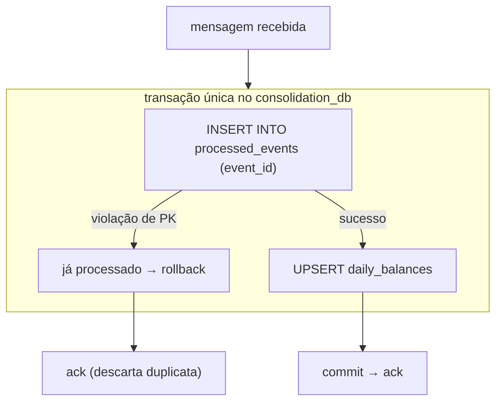

# ADR-007 — Idempotência no consumidor de eventos

- **Status:** Aceito
- **Data:** 2026-08-08
- **Decisores:** rafaelomodei

## Contexto

Duas decisões anteriores tornam a duplicação de eventos **inevitável**:

- [ADR-003](./ADR-003-messaging.md): RabbitMQ entrega *at-least-once*. Se o worker
  processa a mensagem e morre antes do `ack`, o broker reentrega.
- [ADR-004](./ADR-004-transactional-outbox.md): se o publisher publica e morre
  antes de marcar a mensagem como processada, ela é publicada novamente.

Como a consolidação é uma **soma acumulativa**, reprocessar sem proteção corromperia
o saldo de forma silenciosa:

```
Evento: CREDIT 1500
processado 1x → saldo 1500  ✅
processado 2x → saldo 3000  ❌ dinheiro inventado
```

RNF-008 exige explicitamente que reprocessar uma movimentação não duplique seu
impacto no saldo.

## Decisão

O consumidor é **idempotente por `eventId`**, usando uma tabela de eventos
processados e uma **transação única** que abrange a marcação e o efeito.

### Mecanismo

```
processed_events
├── event_id      uuid PRIMARY KEY
└── processed_at  timestamptz
```



Pontos essenciais:

1. A **chave primária** faz o banco recusar a duplicata. Não confiamos em um
   `SELECT` prévio seguido de `INSERT` — isso teria condição de corrida entre
   consumidores concorrentes.
2. Marcação e efeito ocorrem na **mesma transação**. Se elas fossem separadas, um
   crash entre as duas reintroduziria exatamente o problema que se quer evitar.
3. A duplicata recebe `ack` normalmente — ela não é erro, é ruído esperado do
   modelo at-least-once.

### Atualização do saldo

O upsert é feito em uma única instrução atômica, sem leitura prévia:

```sql
INSERT INTO daily_balances (date, total_credits, total_debits, balance, updated_at)
VALUES (@date, @credit, @debit, @credit - @debit, now())
ON CONFLICT (date) DO UPDATE SET
    total_credits = daily_balances.total_credits + EXCLUDED.total_credits,
    total_debits  = daily_balances.total_debits  + EXCLUDED.total_debits,
    balance       = daily_balances.balance       + EXCLUDED.balance,
    updated_at    = now();
```

Isso elimina a corrida de *read-modify-write* entre workers concorrentes: a soma
acontece dentro do banco, não na memória da aplicação.

### Idempotência na entrada da API (fora do escopo do MVP)

Uma chave de idempotência em `POST /transactions` (header `Idempotency-Key`)
protegeria contra o cliente reenviar a mesma requisição. Não está no MVP: o
enunciado não pede, e o risco tratado aqui é o da mensageria, não o do cliente.
Registrado como melhoria futura.

## Alternativas consideradas

| Alternativa | Prós | Contras | Veredito |
|-------------|------|---------|----------|
| Tabela de eventos processados com PK | Simples, garantido pelo banco, sem corrida | Tabela cresce; exige expurgo | **Escolhida** |
| `SELECT` antes do `INSERT` | Intuitivo | Condição de corrida entre consumidores concorrentes | Rejeitada |
| Deduplicação em cache (Redis) | Rápido, TTL automático | Perda de estado do cache reabre a janela de duplicação; mais um componente | Rejeitada |
| Recalcular o saldo do dia inteiro a cada evento | Naturalmente idempotente | Exigiria acesso a todos os lançamentos do dia — reintroduz o acoplamento entre contextos; custo O(n) por evento | Rejeitada |
| Guardar os `transactionId` já aplicados por dia | Idempotência com semântica de negócio | Equivale à tabela de eventos, porém acoplada ao formato do saldo | Rejeitada |
| Exactly-once do broker | Sem código de idempotência | Não existe de fato fim a fim; falsa sensação de segurança | Rejeitada |

## Consequências

**Positivas**

- Reprocessamento é seguro por construção: replay da fila, redeploy do worker ou
  reenvio pelo outbox não corrompem o saldo.
- Viabiliza retry agressivo sem medo (RNF-005).
- O upsert atômico permite escalar o worker horizontalmente.

**Negativas**

- `processed_events` cresce indefinidamente sem uma rotina de expurgo.
- Uma escrita a mais por evento processado.
- A idempotência protege o **efeito no saldo**, não uma eventual duplicação de
  lançamento originada no cliente — limitação explícita.

## Trade-off aceito

Aceitamos **armazenamento extra e uma escrita adicional por evento** em troca de
correção financeira garantida. Em um domínio de dinheiro, saldo silenciosamente
errado é a pior falha possível; o custo é irrisório frente a isso.

Aceitamos também o crescimento da tabela no MVP, com expurgo por retenção
(ex.: 90 dias) registrado como melhoria — a janela real de reentrega é de minutos,
muito menor que qualquer retenção razoável.

## Requisitos atendidos

RNF-004, RNF-007, RNF-008

## Como validar

- Teste unitário: aplicar o mesmo evento duas vezes altera o saldo apenas uma vez.
- Teste de integração: publicar o mesmo `eventId` 10 vezes → saldo aplicado 1 vez.
- Teste de concorrência: N workers consumindo em paralelo produzem o mesmo saldo
  final que um único worker.
- Teste de crash: matar o worker após o efeito e antes do `ack`; ao reprocessar, o
  saldo não muda.
