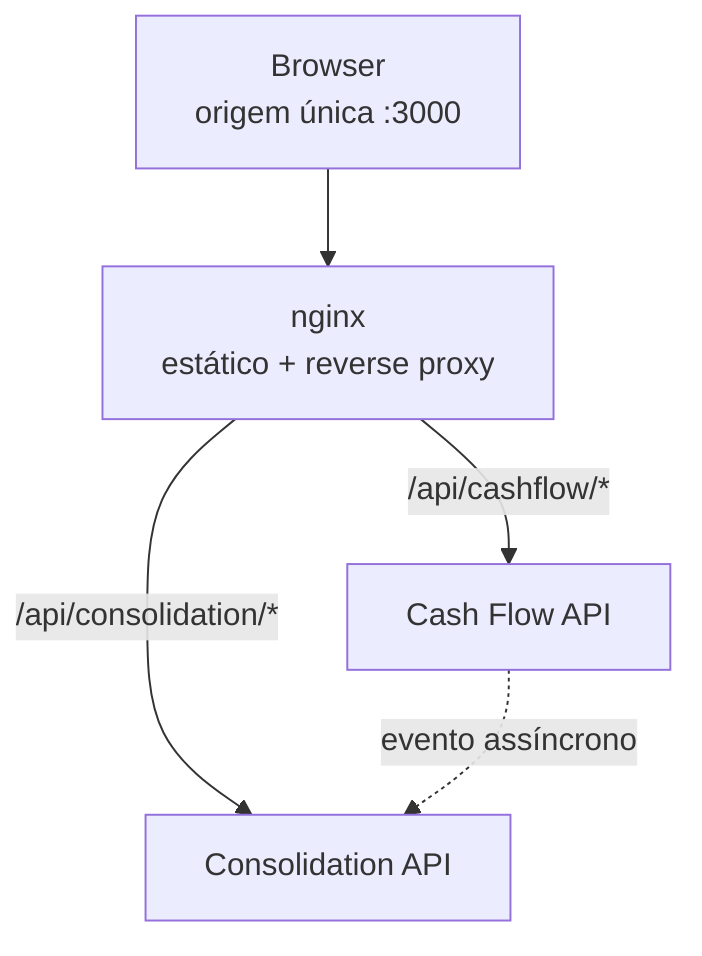

# ADR-015 — Frontend de demonstração: React, Vite e reverse proxy

- **Status:** Aceito
- **Data:** 2026-08-09
- **Decisores:** rafaelomodei

## Contexto

O sistema está completo do ponto de vista funcional, e **invisível**. Tudo o que
ele faz de mais interessante — o lançamento aceito com o broker fora do ar, o
saldo que converge alguns segundos depois, o `updatedAt` que mede essa defasagem —
só é observável hoje por `curl`, Swagger UI ou leitura de log. Quem avalia o
projeto precisa reconstruir mentalmente o comportamento a partir de respostas JSON.

Isso cria um problema real e específico: **a consistência eventual
([ADR-006](./ADR-006-consistency.md)) é a decisão mais fácil de confundir com
defeito**. Um saldo que não reflete o lançamento recém-criado parece bug quando
está em uma resposta HTTP, e parece arquitetura quando a tela diz "atualizado há
2 segundos" e o número converge sozinho na frente de quem olha.

Há uma tensão a resolver antes de qualquer linha de código.
[`scope.md`](../scope.md) §4 registra "Dashboard / frontend complexo" como **fora
de escopo**, com a justificativa "o desafio é de backend". Essa linha continua
correta e não está sendo revogada — o que esta ADR faz é separar o que ela juntava
em uma palavra só: *dashboard complexo* segue fora; uma **vitrine de demonstração
dos endpoints que já existem** entra, sob restrições explícitas.

Existe também um motivo de contexto, e ele é declarado em vez de disfarçado: o
projeto é candidatura a uma vaga na Verity, que atua publicamente com React,
TypeScript e Design Systems. A interface adota a identidade visual pública deles.
Isso é escolha de apresentação, não requisito técnico — e está registrado aqui
para que ninguém precise adivinhar por que a tela é azul.

## Decisão

Adicionamos um **frontend de demonstração** em React + TypeScript + Vite, servido
por nginx, que consome diretamente as duas APIs através de um **reverse proxy de
mesma origem**. Ele não contém regra de negócio, não soma dinheiro e não é um BFF.

### Regra de contenção do frontend

Quatro restrições definem o que este frontend é. Elas valem como fronteira
arquitetural, no mesmo nível das fronteiras de [`AGENTS.md`](../../AGENTS.md):

1. **Nenhuma regra de negócio.** Nada de cálculo de saldo, classificação, ou
   derivação de valor. A tela exibe o que a API respondeu.
2. **O frontend nunca soma dinheiro.** Ver §"Dinheiro no navegador".
3. **Nenhum endpoint novo, nenhuma mudança de contrato.** Se a tela precisar de
   algo que o contrato não oferece, a tela deixa de precisar.
4. **Nenhuma camada de servidor própria.** O proxy encaminha; ele não transforma,
   não agrega e não decide.

Uma funcionalidade de UI que exija violar qualquer uma das quatro não entra.

### Stack

| Item | Escolha | Justificativa |
|------|---------|---------------|
| Biblioteca de UI | **React 19** | Requisito declarado; alinhado ao contexto da vaga |
| Linguagem | **TypeScript** | Os DTOs do contrato viram tipos; divergência de contrato falha na compilação, não em produção |
| Build e dev server | **Vite** | Dev server com proxy embutido — é ele que torna dev e produção idênticos do ponto de vista do browser (§"Mesma origem") |
| Estilo | **Tailwind CSS** | Consome os design tokens como fonte única; sem CSS paralelo competindo com os tokens |
| Estado de servidor | **TanStack Query** | Cache, `loading`/`error`, invalidação e refetch — exatamente o que a convergência do saldo exige (§"Consistência eventual visível") |
| Testes | **Vitest + Testing Library** | Mesmo motor do Vite; teste de comportamento observável, não de implementação ([ADR-008](./ADR-008-tdd.md)) |
| Servidor de produção | **nginx alpine** | Serve estático e encaminha `/api/*`; sem runtime Node em produção |

### Decisões deliberadas de **não** usar

| Descartado | Motivo da recusa |
|-----------|------------------|
| **Next.js** | Resolve SSR, roteamento e API routes — três problemas que uma tela única sem SEO e sem sessão não tem. O motivo forte não é o peso: *API routes* criariam um lugar natural para colocar regra de negócio e para agregar as duas APIs em uma resposta só. Seria o BFF que [ADR-002](./ADR-002-service-decomposition.md) recusa, entrando pela porta dos fundos |
| **Redux / Zustand** | Praticamente todo o estado da tela é *server state*. Uma store manteria uma segunda cópia do que a API já é dona, e a partir daí "qual dos dois está certo" vira pergunta legítima. O estado local que sobra — modal aberto, campos do formulário — é `useState` |
| **Biblioteca de componentes (MUI, Chakra, shadcn/ui)** | O objetivo é demonstrar tokens e composição. Importar um design system pronto entregaria a aparência e removeria justamente o que se quer mostrar |
| **React Router** | Uma tela. Rota é resposta a um problema de navegação que não existe |
| **Biblioteca de máscara monetária** | Um `<input type="number">` com `step="0.01"` e formatação na saída cobre o caso. Ver §"Dinheiro no navegador" |
| **MSW (Mock Service Worker)** | Registrado como alternativa **revisável**: é a forma correta de testar TanStack Query em volume. No tamanho atual — três hooks — um stub de `fetch` custa menos que um service worker e um servidor de mock em CI. Se os testes de integração de tela crescerem, MSW entra sem nova ADR |

## Arquitetura

### O frontend é consumidor dos dois contextos



Isto **não** viola [ADR-002](./ADR-002-service-decomposition.md). A fronteira que
ela protege é `Cash Flow API ✕──HTTP──► Consolidation API`: um serviço não pode
depender da disponibilidade do outro em tempo de requisição. Um cliente que conhece
dois endereços não cria essa dependência — se a Consolidation API cair, o card de
saldo mostra erro e o formulário de lançamento continua funcionando. **A tela
degrada em duas partes independentes, e é assim que ela evidencia RNF-001.**

O que violaria a fronteira seria o proxy montar uma resposta única a partir das
duas APIs. Por isso o proxy encaminha e nada mais: dois clientes separados
(`cashFlowApi.ts`, `consolidationApi.ts`), duas chamadas, dois estados de erro.

### Mesma origem, em vez de CORS

Nenhuma das duas APIs tem CORS configurado hoje. Havia duas formas de resolver:

```
(A) CORS                          (B) reverse proxy
browser :5173                     browser :3000
   ├──► :5001  (origem 2)            ├──► /api/cashflow      ─┐ mesma
   └──► :5002  (origem 3)            └──► /api/consolidation ─┘ origem
```

Escolhemos **(B)**. O ganho decisivo não é evitar o preflight — é que **o browser
nunca aprende o endereço de nenhum serviço**. Não há `VITE_CASHFLOW_API_URL` no
bundle, não há URL de infraestrutura vazando para o cliente, e o mesmo artefato
compilado funciona em qualquer ambiente sem rebuild.

Em desenvolvimento, o `server.proxy` do Vite reproduz os mesmos dois caminhos. A
consequência é a que interessa: **o código que chama `/api/cashflow/transactions`
é byte a byte o mesmo em `npm run dev` e em produção.** Configuração de ambiente
que só existe em um dos dois é a origem clássica do "funciona local e quebra no
container".

Consequência assumida: **nenhuma mudança no backend**. As duas APIs permanecem
exatamente como estão — sem `AddCors`, sem lista de origens permitidas, sem uma
configuração de segurança que precisaria ser revista antes de ir a produção.

Isto é um reverse proxy, não um BFF. A distinção é operacional: o proxy não tem
código nosso, apenas duas diretivas `proxy_pass` em `nginx.conf`. No dia em que
alguém precisar escrever uma linha de lógica ali dentro, isso deixa de ser
verdade — e exige ADR nova, porque passa a ser um terceiro serviço no caminho
crítico.

## Design system

### O que estamos construindo, e o que não estamos

**Não** estamos copiando o Design System da Verity. Ele não existe publicamente:
não há pacote npm, documentação de componentes ou arquivo de tokens publicado.
O que existe é a **identidade visual do site institucional**, e é dela que os
tokens são derivados por inspeção.

A descrição honesta é: *interface inspirada na identidade visual pública da
Verity*, materializada em um mini design system local.

```
site verity.com.br
       ↓  inspeção
design tokens (CSS custom properties)
       ↓  theme
Tailwind
       ↓
componentes de UI
       ↓
tela
```

Ele é **local**: uma pasta `components/ui/`. Não é pacote separado, não é
monorepo, não é build próprio. Publicar um design system de seis componentes
consumido por uma aplicação seria a infraestrutura sem o problema que a justifica.

### Tokens observados no site

Extraídos do CSS e do markup de `https://www.verity.com.br/` em 2026-08-09:

| Token | Valor | Evidência |
|-------|-------|-----------|
| Primário | `#0041FF` | Cor de preenchimento dos ícones, de texto de destaque e início do gradiente da marca |
| Primário escuro | `#1A1086` | Preenchimento de elementos gráficos secundários |
| Acento claro | `#5E97FF` | Contorno de elementos gráficos |
| Gradiente da marca | `linear-gradient(155deg, #0041FF 38.5%, #010EFF 100%)` | Fundo de seção de destaque |
| Superfície | `#FAFAFA` | Fundo alternado de seção |
| Fundo | `#FFFFFF` | Fundo padrão |
| Borda | `#E2E2E2` / `#DBDBDB` | Divisores e contornos |
| Texto secundário | `#8F8F8F` | Texto de apoio |
| Texto primário | `#202020` | Corpo de texto |
| Tipografia | **Poppins** — Light 300, Regular 400, Medium 500, SemiBold 600 | Única família tipográfica do site |
| Raio de botão | **pill** (23px a 61px conforme o tamanho, e `200px` em botões grandes) | Todos os botões do site são totalmente arredondados |

O azul central é coerente com o posicionamento público da marca, que associa a
identidade atual a simplicidade, equilíbrio e clareza. O raio *pill* e a Poppins
são as duas características que mais carregam o reconhecimento visual — um botão
retangular com Inter não se parece com a Verity nem usando o mesmo azul.

### Tokens que **não** vêm da marca

Esta seção existe para que ninguém atribua à Verity uma escolha que é nossa.

O site **não publica paleta semântica** — não há verde de sucesso nem vermelho de
erro que sejam decisão de marca. O `#FF4040` presente no HTML é o valor padrão do
construtor de sites usado por eles, não uma cor escolhida.

Como a tela precisa distinguir crédito de débito, os semânticos são **derivados
por nós** para conviver com o azul primário, e ficam declarados como tais no
arquivo de tokens:

| Token | Papel | Origem |
|-------|-------|--------|
| `--color-success` | Crédito | Nosso — verde escolhido para contraste AA sobre `#FFFFFF` |
| `--color-danger` | Débito, erro | Nosso — vermelho escolhido pelo mesmo critério |

Contraste mínimo AA (4.5:1 para texto) é requisito de todos os pares
texto/fundo — inclusive `#8F8F8F`, que reprova sobre branco em tamanho pequeno e
por isso fica restrito a texto grande ou é escurecido no token.

### Estrutura

```
src/Frontend/
├── src/
│   ├── app/           App.tsx, providers.tsx
│   ├── api/           cashFlowApi.ts, consolidationApi.ts
│   ├── components/ui/ Button, Input, Select, Card, Badge, Modal, Table
│   ├── features/
│   │   ├── transactions/    TransactionForm, TransactionTable, hooks
│   │   └── daily-balance/   BalanceCard, useDailyBalance
│   ├── pages/         DashboardPage.tsx
│   ├── styles/        globals.css  ← os tokens vivem aqui
│   └── main.tsx
├── Dockerfile
├── nginx.conf
└── vite.config.ts
```

`components/ui/` não conhece o domínio: `Button` não sabe o que é um lançamento.
`features/` conhece o domínio e compõe os primitivos. É a única fronteira interna
do frontend, e é a que impede o design system de virar um amontoado de componentes
específicos de tela.

`src/Frontend/` fica sob `src/`, junto dos projetos da solution. Alternativa
considerada: `frontend/` na raiz, seguindo o precedente de `k6/`, que também não é
.NET. Ficou em `src/` por manter todo código-fonte sob um teto só; é decisão
reversível com um `git mv` e não merece mais do que esta linha.

## Comportamento da tela

Uma tela. Um modal.

```
┌───────────────────────────────────────────────────────────┐
│  Cash Flow                                                │
├───────────────────────────────────────────────────────────┤
│  Saldo do dia      Créditos        Débitos    [ data ▼ ]  │
│  R$ 8.540,00       R$ 12.300,00    R$ 3.760,00            │
│  atualizado há 3 s                                        │
├───────────────────────────────────────────────────────────┤
│  Lançamentos        [ período ]      + Novo lançamento    │
│  Data     Descrição        Tipo       Valor               │
│  09/08    Venda produto    Crédito    R$ 500,00           │
│  09/08    Fornecedor       Débito     R$ 200,00           │
│                     Carregar mais                          │
└───────────────────────────────────────────────────────────┘
```

### Consistência eventual visível

Este é o comportamento que justifica a ADR, e o único ponto da tela com lógica
temporal:

1. `POST /transactions` responde `201`. A linha aparece na tabela imediatamente —
   o lançamento **está** registrado.
2. O card de saldo entra em estado "sincronizando" e passa a refazer
   `GET /daily-balances/{date}` em intervalo curto.
3. Quando `updatedAt` avança além do instante do `201`, o saldo convergiu: o
   polling para e o card volta a exibir "atualizado há N s".

O passo 3 tem condição de parada explícita — por tempo máximo, não só por sucesso.
Um `refetchInterval` sem critério de término é polling infinito, e a tela ficaria
consultando o saldo para sempre em uma aba esquecida aberta. Esgotado o limite sem
convergência, o card informa que a consolidação está atrasada e oferece atualizar
manualmente. **Que é exatamente o diagnóstico correto quando o worker está fora do
ar** — a tela mostra a verdade em vez de girar um spinner.

`updatedAt` deixa de ser um campo do JSON e vira o elemento de UI que prova a
ADR-006.

### Dinheiro no navegador

**O frontend nunca soma, subtrai ou deriva um valor monetário.** Os três números
do topo — saldo, créditos, débitos — vêm prontos de `GET /daily-balances/{date}`.

O motivo é aritmético, não estilístico: `number` em JavaScript é ponto flutuante
binário, e `0.1 + 0.2 === 0.30000000000000004`. Somar `amount` no cliente
produziria centavos divergentes do backend, que usa `decimal` e `numeric(18,2)`
([ADR-013](./ADR-013-money-representation.md)). Seriam dois totais para o mesmo
dia, e o errado seria o que o usuário vê.

Ler e formatar um valor recebido é seguro; combinar dois não é. O total que a
tela não puder pedir ao backend, a tela não exibe.

Na entrada, `amount` é enviado como número com no máximo duas casas, conforme
[`api-contracts.md`](../api-contracts.md) §1.4 — três casas viram `400`, e essa
mensagem é exibida no campo em vez de ser arredondada em silêncio pelo cliente.

### Filtros

Os filtros da tela são **exatamente** os do contrato, e nenhum a mais:

| Filtro | Endpoint | Parâmetro |
|--------|----------|-----------|
| Período dos lançamentos | `GET /transactions` | `startDate`, `endDate` |
| Dia do saldo | `GET /daily-balances/{date}` | `{date}` no path |

**Não há filtro por tipo (crédito/débito).** A API não oferece, e implementá-lo no
cliente sobre uma lista paginada por cursor produziria um resultado errado de forma
convincente: o usuário veria "apenas créditos" filtrado sobre as páginas já
carregadas, com a barra rolada até o fim, acreditando estar vendo todos os créditos
do período. Um filtro que mente é pior que um filtro ausente. Se ele passar a ser
necessário, o caminho é `GET /transactions?type=`, no contrato — não na tela.

Paginação é "Carregar mais" consumindo `nextCursor`, como
[ADR-014](./ADR-014-cursor-pagination.md) previu. Sem numeração de páginas: o
contrato não expõe `totalCount`, deliberadamente, e uma UI de páginas numeradas
exigiria inventá-lo.

### Estados

Todo dado remoto tem quatro estados, e nenhum deles é tela em branco: `loading`,
`empty`, `error`, `success`. Dois merecem nota:

- **Vazio ≠ erro.** Período sem lançamentos é `200` com `items: []`, e dia sem
  movimentação é `200` com saldo zerado — a tela mostra zero, não "não
  encontrado". É a mesma regra do contrato (§4.4), agora no cliente.
- **Erro é por região.** Falha no saldo não derruba a tabela, e vice-versa. É a
  independência dos dois contextos aparecendo na interface.

Erros de `400` de validação são exibidos campo a campo, consumindo o `errors` do
Problem Details. O `correlationId` do corpo é exibido na mensagem de erro
inesperado — é o que transforma "deu erro" em algo rastreável no log
([ADR-011](./ADR-011-observability.md)).

## Alternativas consideradas

| Alternativa | Prós | Contras | Veredito |
|-------------|------|---------|----------|
| **Não fazer frontend** | Mantém `scope.md` intocado; zero código novo | A consistência eventual continua invisível e passível de ser lida como defeito | Rejeitada — o custo de ser mal interpretado é maior que o de um container |
| Next.js | Framework completo, familiar ao mercado | SSR e roteamento sem problema correspondente; *API routes* convidam ao BFF que ADR-002 recusa | Rejeitada |
| Redux Toolkit | Estado previsível, devtools | Duplica o server state que TanStack Query já governa | Rejeitada |
| CORS nas duas APIs | Sem container extra; setup em minutos | Endereços de serviço no bundle; configuração de dev diferente da de produção; mudança de segurança no backend | Rejeitada, mas defensável para desenvolvimento local |
| BFF (Node/Nest) agregando as duas APIs | Uma chamada só para a tela | Recria o acoplamento síncrono que ADR-002 existe para impedir, e esconde a degradação parcial que a tela deveria evidenciar | **Rejeitada por conflito arquitetural** |
| Biblioteca de componentes pronta | Entrega mais rápida e acessível | Remove exatamente o que a tela existe para demonstrar | Rejeitada |
| Servir o frontend por uma das duas APIs (`wwwroot`) | Um container a menos | Amarraria a tela ao ciclo de vida de um dos serviços e daria a um deles um papel que o outro não tem | Rejeitada |

## Consequências

**Positivas**

- A consistência eventual passa a ser **demonstrável**, não apenas descrita.
- A degradação parcial fica visível: derrubar a Consolidation API deixa metade da
  tela funcionando, o que é a evidência mais direta de RNF-001.
- Nenhuma mudança no backend — sem CORS, sem endpoint novo, sem alteração de
  contrato. O risco de a interface quebrar o que já está verde é próximo de zero.
- O TypeScript transforma o contrato em tipos: um campo renomeado na API quebra a
  compilação do frontend, e não a tela em produção.
- O bundle não conhece endereço de infraestrutura.

**Negativas**

- Sétimo container no Compose, com o custo de recursos correspondente.
- Segundo ecossistema de ferramentas no repositório (Node, npm, Vitest), com CI e
  `.gitignore` próprios.
- Os tipos do frontend são uma **segunda declaração** do contrato, escrita à mão.
  Divergência silenciosa é possível — nada gera esses tipos a partir da OpenAPI
  hoje. Mitigação registrada abaixo.
- A identidade visual é uma aproximação por inspeção. Pode divergir do manual de
  marca da Verity, que não é público.
- O proxy adiciona um salto de rede e um lugar a mais onde uma requisição pode se
  perder por erro de configuração.

**Registrado como melhoria futura, não como pré-requisito:** gerar os tipos do
cliente a partir de `/openapi/v1.json` das duas APIs. Resolve a divergência
silenciosa de forma definitiva, e custa uma etapa de build que o tamanho atual —
seis campos por DTO — não justifica.

## Trade-off aceito

Aceitamos **um container e um ecossistema a mais** para tornar visível o
comportamento que é o núcleo do projeto. É um custo real de manutenção pago por
um ganho de comunicação, e a troca só se sustenta enquanto a regra de contenção
for respeitada: no instante em que o frontend passar a calcular qualquer coisa,
ele deixa de ser uma vitrine e vira um segundo lugar onde a regra de negócio mora
— que é a forma como projetos assim costumam apodrecer.

Aceitamos também **não ter o design system oficial da Verity**, porque ele não é
público. O que entregamos é uma aproximação declarada como tal. Um design system
inspirado e honesto vale mais que um que se apresente como cópia fiel sem ser.

## Requisitos atendidos

**Nenhum requisito novo.** O frontend não implementa RF nem RNF — ele consome
RF-001 a RF-006 pelos contratos existentes.

Esta ADR existe por dois motivos, e ambos são estruturais segundo o critério de
[`decisions/README.md`](./README.md): acrescenta um **container** à topologia e
reabre uma linha de [`scope.md`](../scope.md) §4. Reverter qualquer um dos dois
depois custa mais que uma tarde.

Requisitos que a tela torna **observáveis**, sem implementar: RNF-001
(degradação parcial), RNF-006 (consistência eventual via `updatedAt`), RNF-011
(Problem Details exibido campo a campo), RNF-013 (`correlationId` visível).

## Como validar

- `docker compose up -d` sobe sete containers e a tela responde em `:3000`.
- Nenhum endereço de API aparece no bundle:
  `grep -r "5001\|5002" src/Frontend/dist/` não retorna nada.
- `grep -rn "AddCors" src/` continua sem resultado — a decisão de mesma origem
  está sendo respeitada.
- Com a Consolidation API parada, o formulário de lançamento continua
  funcionando e apenas o card de saldo exibe erro.
- Com o Consolidation Worker parado, o card informa consolidação atrasada em
  tempo finito, e o polling termina.
- Nenhum operador aritmético sobre `amount` fora de formatação: a busca por
  `+`, `-` e `reduce` em `features/` não encontra soma de valores monetários.
- `npm run test` e `npm run build` verdes no CI, junto dos jobs .NET.

## Escopo desta ADR

Esta ADR cobre a **decisão**. A execução é a etapa 15 de
[`progress.md`](../progress.md), e segue o mesmo fluxo das demais: teste primeiro,
implementação mínima, refatoração ([ADR-008](./ADR-008-tdd.md)). TDD no frontend
se aplica ao comportamento observável — o formulário rejeita valor inválido, o
card de saldo mostra erro quando a API falha, a tabela exibe o estado vazio — e
não a detalhes de renderização, que mudam sem que nada quebre.
