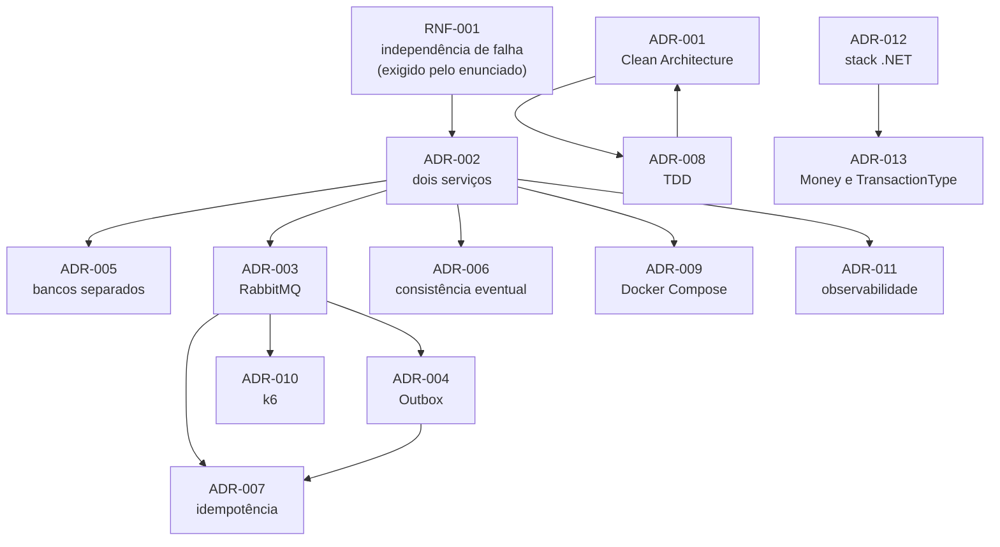

# Architecture Decision Records (ADR)

Registro das decisões arquiteturais do projeto. Cada ADR documenta o **contexto**
que forçou a decisão, as **alternativas** avaliadas, as **consequências** e o
**trade-off aceito** — inclusive as consequências negativas.

O objetivo é que qualquer escolha do projeto possa ser questionada e respondida
com um documento, e não com "foi assim que decidimos".

## Índice

| ADR | Título | Status | Requisitos principais |
|-----|--------|--------|----------------------|
| [ADR-001](./ADR-001-architecture.md) | Clean Architecture com SOLID como regra estrutural | Aceito | RT-006, RNF-010 |
| [ADR-002](./ADR-002-service-decomposition.md) | Dois serviços independentes: Lançamentos e Consolidação | Aceito | RNF-001, RNF-002 |
| [ADR-003](./ADR-003-messaging.md) | RabbitMQ como broker de mensageria | Aceito | RNF-003, RNF-004, RNF-005 |
| [ADR-004](./ADR-004-transactional-outbox.md) | Transactional Outbox para publicação confiável de eventos | Aceito | RNF-004, RNF-007 |
| [ADR-005](./ADR-005-database.md) | PostgreSQL com bancos independentes por contexto | Aceito | RNF-001, RNF-002 |
| [ADR-006](./ADR-006-consistency.md) | Consistência eventual entre lançamentos e saldo | Aceito | RNF-006 |
| [ADR-007](./ADR-007-idempotency.md) | Idempotência no consumidor de eventos | Aceito | RNF-008 |
| [ADR-008](./ADR-008-tdd.md) | TDD como fluxo de desenvolvimento | Aceito | RT-002, RNF-009 |
| [ADR-009](./ADR-009-containers.md) | Docker e Docker Compose para reprodutibilidade | Aceito | RNF-012, RT-007 |
| [ADR-010](./ADR-010-performance-validation.md) | Validação de performance com k6 | Aceito | RNF-003, RNF-004 |
| [ADR-011](./ADR-011-observability.md) | Observabilidade: logs, correlação e health checks | Aceito | RNF-011, RNF-013 |
| [ADR-012](./ADR-012-tech-stack.md) | Stack técnica: .NET 10 e ASP.NET Core | Aceito | RT-001 |
| [ADR-013](./ADR-013-money-representation.md) | Representação de valores monetários e tipo de lançamento | Aceito | RN-001..004 |

Template para novas decisões: [ADR-000](./ADR-000-template.md).

## Grafo de dependência entre as decisões

Nenhuma decisão aqui é isolada. Este grafo mostra o que força o quê:

Leitura do grafo: **tudo à direita de RNF-001 existe por causa dele**. Removido o
requisito de independência de falha, ADR-002 cairia — e com ela cairiam mensageria,
outbox, idempotência, bancos separados e consistência eventual, restando um
monolito modular. Isso é intencional: nenhuma peça está no projeto por si mesma.

ADR-001 e ADR-008 se reforçam mutuamente (Clean Architecture viabiliza o TDD; o
TDD pressiona por fronteiras limpas). ADR-012 e ADR-013 são consequência da
restrição de linguagem e da natureza financeira do domínio, independentes do resto.

## Quando criar uma nova ADR

As 13 ADRs acima cobrem o desenho do sistema. Daqui para frente o conjunto é
tratado como **fechado por padrão**: documentação que cresce mais rápido que o
sistema deixa de ser justificativa e passa a ser ruído.

Uma nova ADR só é criada quando uma decisão **estrutural** muda ou aparece:

| Cria ADR | Não cria ADR |
|----------|--------------|
| Trocar o mecanismo de outbox por outra abordagem | Nome de DTO ou de endpoint |
| Trocar o banco ou a topologia de bancos | Escolha de biblioteca trivial |
| Mudar a estratégia de retry / DLQ | Estrutura de pastas dentro de um projeto |
| Mudar a divisão entre os serviços | Regra de validação específica |
| Mudar o contrato de evento de forma incompatível | Detalhe de implementação reversível em uma tarde |

O critério prático: se a decisão for cara de reverter e afetar mais de um
componente, vira ADR. Caso contrário, vira comentário no código ou nota na
documentação existente.

## Convenções

- Numeração sequencial, sem reuso: uma ADR nunca é apagada.
- Status possíveis: `Proposto`, `Aceito`, `Rejeitado`, `Substituído por ADR-XXX`.
- Decisão revista **não** é editada: cria-se uma nova ADR que a substitui, e a
  antiga passa a `Substituído por`. O histórico do raciocínio é parte do valor.
